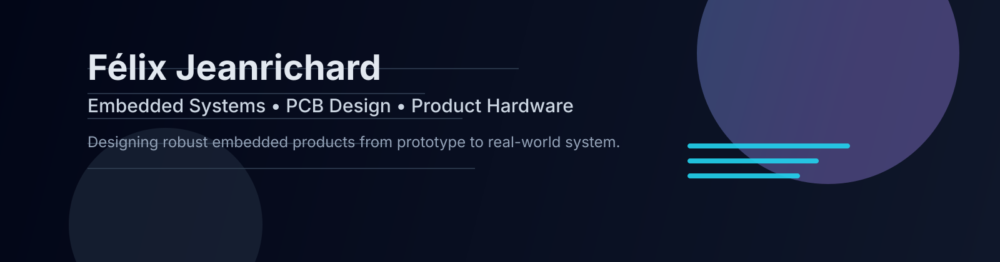

  

  
  
  

---

## About

I build embedded products at the intersection of electronics, firmware, mechanics, and industrial design.

My work emphasizes product coherence: architecture, prototyping speed, and real-world reliability from the first iterations.

Outside engineering work, I fly FPV drones and practice orienteering—both shape how I approach control, precision, and field-tested systems.

## Technical focus

- Embedded electronics and low-level firmware
- PCB architecture and board bring-up
- Real-time control on microcontrollers
- IoT and wireless communication systems
- RF links, synchronization, and low-power design
- Mechanical integration and rapid prototyping

## Stack

| Layer | Tools and technologies |
| --- | --- |
| Firmware | C++, C, PlatformIO |
| Hardware | ESP32, STM32, embedded peripherals, custom PCB design |
| EDA | Altium Designer |
| Mechanical | Onshape, 3D design, prototyping |
| Systems | IoT, RF communication, distributed embedded nodes |

## Featured projects

### OrbitDeck
Modular productivity and control hardware platform.

- Hall effect 3D mouse input
- Programmable shortcut system
- Custom firmware + custom PCB
- Product-focused industrial design

### Virtual Pacer System
Wireless pacing platform for athletics tracks.

- RF mesh communication
- Synchronized pacing lights
- Real-time wireless timing
- Low-power distributed nodes

## Current focus

- Cleaner embedded product architecture
- Stronger PCB and firmware pipelines
- Better RF robustness and power efficiency
- More rigorous engineering project documentation

## GitHub

  
  

## Contact

Instagram: **@felix.jrdb**

Open to hardware collaborations, technical conversations, and sponsor discussions.
